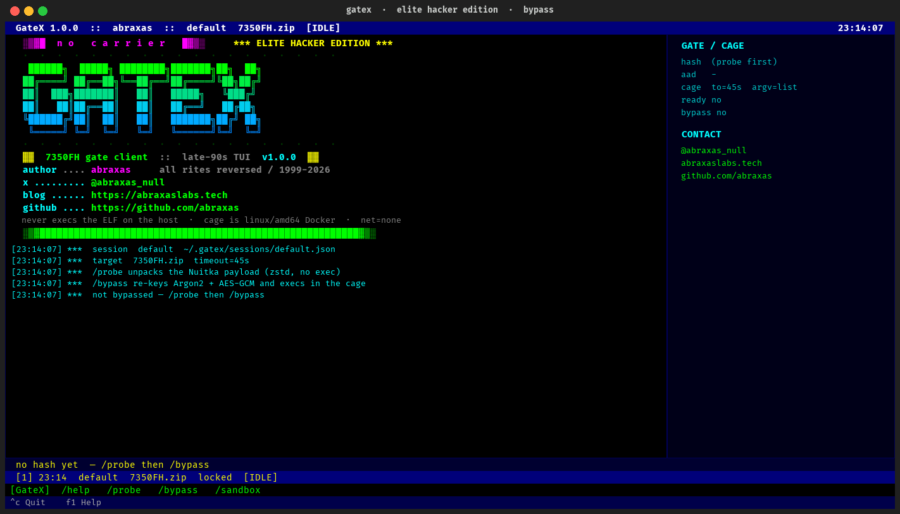
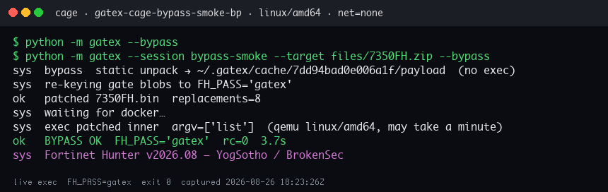
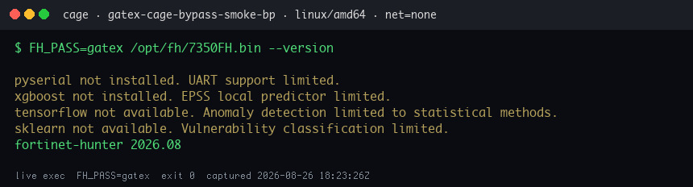
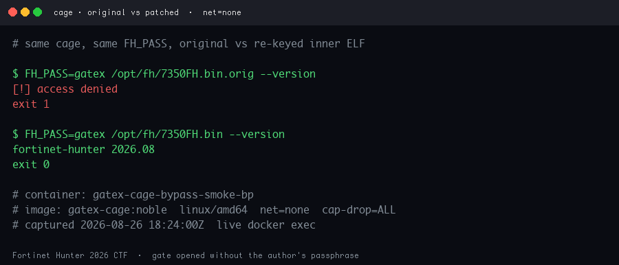
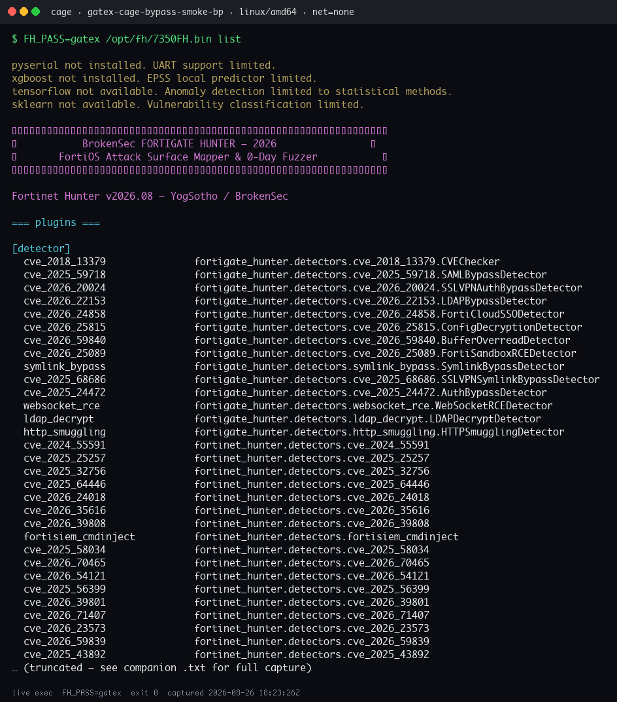

# GateX



Late-90s IRC TUI that **re-keys** the Fortinet Hunter 2026 Nuitka password gate.

The ELF never runs on the host. GateX statically unpacks the onefile payload, XOR-unmasks the scrambled Argon2id hash and AES-GCM banner, rewrites those blobs so `FH_PASS=gatex` satisfies both checks, then execs the inner binary inside a locked-down Docker cage.

This does **not** recover the author's original passphrase. Argon2id (`m=65536,t=3,p=4`) is doing its job. The plugins were already compiled into the inner ELF; the password only unwraps a banner.

Write-up: **[Hunting the Fortinet Hunter 0-day](https://abraxaslabs.tech/research/hunting-the-fortinet-hunter-0-day)**

---

**abraxas**
- X / Twitter: [@abraxas_null](https://x.com/abraxas_null)
- Blog: [abraxaslabs.tech](https://abraxaslabs.tech)
- GitHub: [github.com/abraxas](https://github.com/abraxas)
- This repo: [github.com/abraxas/GateX](https://github.com/abraxas/GateX)

---

## What you need

- Python 3.11+
- Docker Desktop (linux/amd64 — qemu/Rosetta on Apple Silicon)
- The CTF zip `7350FH.zip` (not shipped; drop it at `files/7350FH.zip`)

The payload is untrusted CTF malware-shaped code. GateX only `exec`s it under:

- `--platform linux/amd64`
- `--network none`
- `--read-only` + tmpfs for unpack
- `--cap-drop ALL --security-opt no-new-privileges:true`
- uid `65532`, 2 GiB RAM, 1 CPU, 256 pids

## Install

```bash
git clone git@github.com:abraxas/GateX.git
cd GateX
python3 -m venv .venv
.venv/bin/pip install -r requirements.txt
```

Place the challenge zip (or the inner ELF) where GateX can see it:

```bash
mkdir -p files
cp /path/to/7350FH.zip files/7350FH.zip
```

## Run

TUI:

```bash
.venv/bin/python -m gatex --target files/7350FH.zip
```

Inside the TUI:

```
/probe          # static zstd unpack + assemble the Argon2id hash (no exec)
/sandbox up     # start Docker, build gatex-cage:noble
/bypass         # re-key to FH_PASS=gatex and exec list in the cage
/cmd --help     # argv against the patched inner ELF
/cmd --version
/cmd score --ml
```

Headless:

```bash
# unpack + print the assembled argon2id hash (no TUI, no exec)
.venv/bin/python -m gatex --target files/7350FH.zip --probe

# re-key + exec list in the cage
.venv/bin/python -m gatex --target files/7350FH.zip --bypass
```

Optional `--session name` keeps state under `~/.gatex/sessions/` (mode 0600).

## Commands

| Command | What it does |
|---|---|
| `/help` | Command list |
| `/probe` | Static unpack + assemble Argon2id hash (no exec) |
| `/bypass [password]` | Re-key gate blobs (default `gatex`) and exec in the cage |
| `/cmd [args…]` | argv passed to the patched ELF (`list`, `--help`, `--version`, …) |
| `/sandbox` `/sandbox up` `/sandbox down` | Docker status / build / destroy |
| `/target <zip\|elf>` | Switch binary |
| `/session name` | Switch reusable session |
| `/timeout <seconds>` | Cage exec timeout |
| `/quit` | Save and leave |

F1 = help.

## How the gate actually works

1. Outer ELF is a stripped Nuitka onefile (`KAY` + zstd). Inner image is `7350FH.bin`.
2. Fourteen XOR-scrambled base64 blobs sit in front of the Nuitka `BYTES` constant `c` + `fh-slim-hardened-v2`.
3. Unmask is `utf-8(xor(b64decode(ct), cycle(b64decode(key))))`. Three fragments assemble the real PHC. A plaintext Argon2 string in the binary is the `argon2-cffi` doctest decoy — ignore it.
4. Pipeline: Argon2id verify → HKDF-SHA256 (`fh-slim-v2-salt-2026` / `fh-slim-v2-core`) → AES-256-GCM of a **79-byte banner**. Then `cli.main()`. The exploits are not in the ciphertext.
5. `/bypass` writes a new PHC of a password you know, encrypts a replacement banner under AAD `b"fh-slim-hardened-v2"` (the bytes value, **not** the on-disk `cfh-…` needle), and runs the patched inner as `/opt/fh/7350FH.bin` with `LD_LIBRARY_PATH=$ORIGIN`.

Original inner + `FH_PASS=gatex` still prints `[!] access denied`. That is the experiment.

## Evidence

Live `docker exec` against the re-keyed inner, linux/amd64, net none, caps dropped, uid 65532. Captured 2026-08-26.









Full transcripts: `files/evidence/*.txt` and `files/hunter-cli/`.

## Tests

```bash
.venv/bin/pip install pytest
.venv/bin/python -m pytest tests/test_offline.py -q
```

Patch/unpack tests that need `files/7350FH.zip` skip if the zip is absent.

## License / scope

Written for a CTF the author permitted. Do not point this at systems you do not own. GateX ships no exploits and no copy of `7350FH`.
